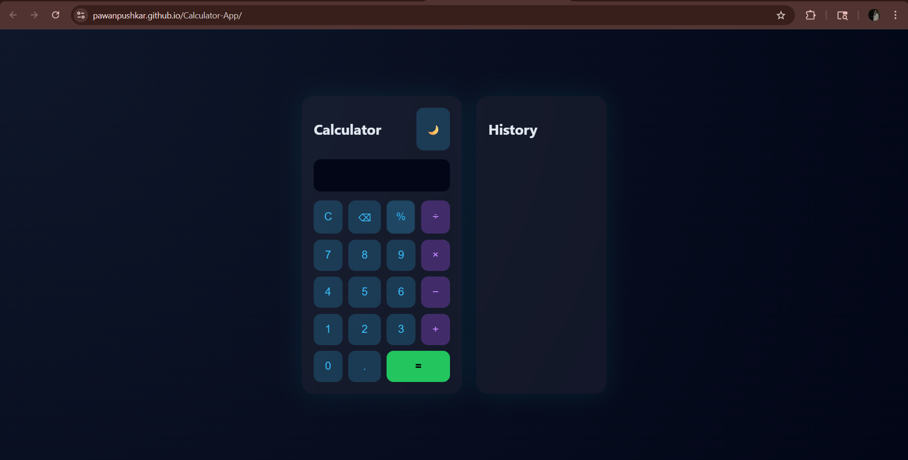

# 💎 Premium Calculator Web App

A modern, responsive **Calculator Web Application** built using **HTML, CSS, and JavaScript** with a premium glassmorphism UI, smooth animations, and advanced features.

---

## 🚀 Features

✨ **Premium UI Design**

* Glassmorphism effect
* Modern dark theme with smooth gradients
* Clean and minimal layout

🧮 **Calculator Functionality**

* Basic arithmetic operations (+, −, ×, ÷, %)
* Real-time input display
* Error handling for invalid expressions

📜 **History Panel**

* Stores previous calculations
* Displays latest results on top

⌨️ **Keyboard Support**

* Type directly using keyboard
* Enter → Calculate
* Backspace → Delete
* ESC → Clear

🌙 **Theme Toggle**

* Switch between dark and light mode

⚡ **Interactive Effects**

* Button hover animations
* Smooth click feedback

---

## 🛠️ Tech Stack

* **HTML5** – Structure
* **CSS3** – Styling (Glass UI + Animations)
* **JavaScript (ES6)** – Logic & DOM Manipulation

---

## 📂 Project Structure

```
calculator-pro/
│── index.html
│── style.css
│── script.js
```

---

## ▶️ How to Run

1. Download or clone the repository
2. Open the project folder
3. Run the file:

```
index.html
```

OR (recommended)

Use **Live Server** in VS Code for better experience.

---

## 📸 Preview





---

## 🌟 Future Enhancements

* Scientific calculator functions (sin, cos, log)
* Save history using localStorage
* Sound effects 🔊
* Mobile responsive design 📱
* Advanced animations

---

## 👨‍💻 Author

**Dipak Singh**


